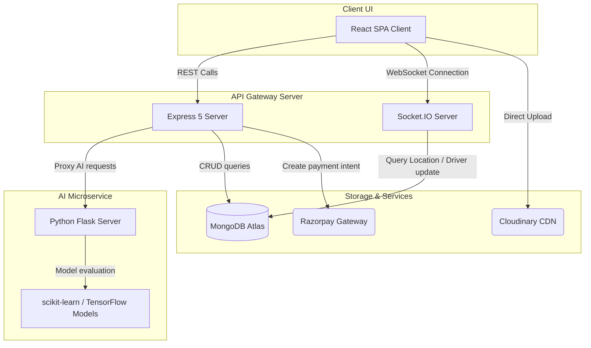

# 🍔 Foodie Rusher

A production-ready, full-stack food delivery and management platform featuring real-time socket-based tracking, interactive maps, dynamic AI services, and dual checkouts (Razorpay + Cash on Delivery).

---

## 📖 Table of Contents
- [🚀 Quick Start](#-quick-start)
- [📦 Directory Structure](#-directory-structure)
- [✨ Key Features](#-key-features)
- [🛠 Technical Stack](#-technical-stack)
- [🏗 System Architecture](#-system-architecture)
- [🔐 Environment Configuration](#-environment-configuration)
- [📡 API Endpoints Overview](#-api-endpoints-overview)
- [⚡ Real-Time WebSockets](#-real-time-websockets)
- [🤖 AI Microservice Details](#-ai-microservice-details)
- [🗄 Database Schemas](#-database-schemas)
- [🚢 Production Deployment](#-production-deployment)
- [🛠 Troubleshooting & Development Notes](#-troubleshooting--development-notes)

---

## 🚀 Quick Start

### 1. Prerequisite Installations
- **Node.js**: Version `20.x` or higher (required by Mongoose 9 authentication features)
- **MongoDB**: Local Community Server or a MongoDB Atlas Cloud instance
- **Python**: Version `3.10+` (needed for the AI recommendation microservice)

### 2. Dependency Setup
Install workspace, frontend, and backend packages via the root workspace manager:
```bash
npm run install:all
```

### 3. Environment Variables
Create your local environment file at `backend/.env` using the template:
```bash
cp backend/.env.example backend/.env
```
Open `backend/.env` and update the connection URI and API keys (MongoDB, Razorpay, Cloudinary, SMTP).

### 4. Database Seeding
Initialize sample location areas and mock accounts (Customers, Restaurant Owners, Delivery Staff):
```bash
# Seed service location sectors
npm run seed:locations

# Seed test roles (Default password: password123)
npm run seed:test
```

### 5. Running the Application
Launch all application servers (Backend, React frontend client, and Flask AI service) in concurrent development mode:
```bash
npm run dev
```
- **React Frontend**: `http://localhost:5173`
- **Express Backend API**: `http://localhost:5000`
- **AI Microservice**: `http://localhost:5002`

---

## 📦 Directory Structure

```
Foodie_Rusher/
├── Dockerfile                    # Multi-stage production container configuration
├── docker-compose.yml            # Multi-container orchestration workflow
├── package.json                  # Root workspace script definitions
│
├── backend/                      # Node.js Express 5 API Service
│   ├── ai_services/              # Python Flask AI Engine
│   │   ├── ai_services/
│   │   │   ├── app.py            # Microservice router
│   │   │   └── *.py              # Recurrent GRU & Scikit-learn pipelines
│   │   └── requirements.txt      # Python dependencies
│   ├── src/
│   │   ├── config/               # Database connectivity configurations
│   │   ├── middleware/           # Route security filters (JWT validation)
│   │   ├── models/               # Mongoose database models
│   │   ├── routes/               # API Router endpoints
│   │   ├── sockets/              # Socket.IO channel streams (live maps)
│   │   └── server.js             # Main server startup & React distribution server
│   └── scripts/                  # Seed controllers
│
└── frontend/                     # React Client SPA
    ├── src/
    │   ├── components/           # UI elements, widgets, and AI chat assistants
    │   ├── context/              # Context Providers (Auth, Socket, Geolocation)
    │   ├── pages/                # App views (Landing, Auth, Cart, Profile layouts)
    │   ├── App.jsx               # Routes and role-based guards
    │   ├── config.js             # Relative URL configuration wrapper
    │   └── main.jsx              # React index wrapper
```

---

## ✨ Key Features

### 👤 Multi-Role Dashboard Systems
- **Customer Portal**: Browse nearby restaurants, manage cart orders, checkout, view transaction logs, and utilize loyalty wallets.
- **Restaurant Owner Portal**: Manage shop profiles, edit menu items (CRUD), process incoming orders, and review sales analytics.
- **Delivery Partner Portal**: Accept pending orders, update delivery statuses, and stream real-time GPS locations.

### 📍 Real-Time Tracking & Interactive Maps
- Periodically uploads delivery coordinates via WebSockets.
- Renders routes dynamically utilizing Leaflet.js map layers with marker tracking.

### 💳 Transaction & Promotion Systems
- Dual-channel payment checkout: integrated Razorpay payment gateway and Cash on Delivery (COD).
- Customer Referral Engine: Earn wallet balance by sharing personal referral codes.
- Promo Engine: Generate custom discount percentages with expire intervals.

### 🤖 AI-Driven Microservices
- Food Recommendation: Analyzes user preferences and returns recommended items using a hybrid filtering model.
- Time-Series Demand Forecasting: Predicts order volume trends to help owners prepare inventory.

---

## 🛠 Technical Stack

| Category | Technologies Used |
|---|---|
| **Frontend** | React 18, Vite, Tailwind CSS 4.0, Framer Motion, Leaflet.js |
| **Backend** | Node.js 20+, Express 5, Socket.IO 4.x, MongoDB + Mongoose 9, JWT |
| **AI Service** | Python 3.10+, Flask, scikit-learn, NumPy, pandas, (optional TensorFlow) |
| **Integrations** | Razorpay SDK, Cloudinary Image CDN, Nodemailer SMTP |
| **Deployment** | Docker Multi-stage, Docker Compose, Render |

---

## 🏗 System Architecture



---

## 🔐 Environment Configuration

Create a file named `backend/.env` containing the parameters listed below:

```properties
# Network Configurations
PORT=5000

# Database
MONGO_URI=mongodb+srv://<username>:<password>@cluster.mongodb.net/food_delivery

# Auth Secrets
JWT_SECRET=generate_a_secure_token_here

# Notification Emails (Nodemailer)
EMAIL=your-configured-email@gmail.com
PASS=your-gmail-app-password

# CDN Storage (Cloudinary)
CLOUDINARY_CLOUD_NAME=cloudinary_name
CLOUDINARY_API_KEY=cloudinary_api_key
CLOUDINARY_API_SECRET=cloudinary_api_secret

# Optional Allowed CORS Origins
ALLOWED_ORIGINS=http://localhost:5173,http://localhost:5000
```

---

## 📡 API Endpoints Overview

### Authentication `/auth`
* `POST /register`: Registers new user profiles (customer, owner, or staff).
* `POST /login`: Validates password hashes and returns a signed JWT.
* `POST /forgot-password`: Generates a dynamic OTP code and emails it to the user.
* `POST /verify-otp`: Confirms validity of the OTP to authorize password resets.

### Restaurant & Item Management `/api/shop` & `/api/item`
* `GET /api/shop`: Returns list of open restaurants.
* `POST /api/shop`: Creates a restaurant profile (Requires Owner role).
* `GET /api/item`: Returns items filtered by `shopId`.
* `POST /api/item`: Adds a menu item with Cloudinary image upload middleware.

### Orders & Checkout `/orders`
* `POST /orders`: Instantiates a new order transaction.
* `PUT /orders/:id/status`: Updates tracking status (`preparing`, `out_for_delivery`, `delivered`).
* `POST /create-razorpay-order`: Initiates a transaction intent for the Razorpay API.

---

## ⚡ Real-Time WebSockets

The communication layer uses standard Socket.IO events for server-client synchronization:

1. **`join-order`**: Clients subscribe to a channel unique to their order ID.
2. **`update-location`**: Delivery partners post their coordinate packages `{userId, lat, lng, orderId}`.
3. **`delivery-tracking`**: Broadcasts the location changes to customers subscribed to that order's room.
4. **`order-created`**: Emits signals to notify restaurant owners of new orders in real-time.

---

## 🤖 AI Microservice Details

The AI engine runs as a separate Flask server:
- **Food Recommendation (`/recommend`)**: Implements collaborative filtering and content filtering algorithms to suggest items based on past orders and cuisine matching.
- **Demand Forecasting (`/forecast`)**: Predicts order volumes based on historical transaction data.
- **Dynamic Pricing (`/dynamic-price`)**: Adjusts delivery fees or item pricing dynamically based on current order volume density.

> [!NOTE]  
> If TensorFlow is not installed, the microservice gracefully falls back to statistical heuristics, keeping recommendations and pricing calculation operational.

---

## 🗄 Database Schemas

### User
```json
{
  "name": "string",
  "email": "string",
  "role": "customer | owner | staff",
  "walletBalance": "number",
  "location": { "lat": "number", "lng": "number", "updatedAt": "date" },
  "referralCode": "string"
}
```

### Shop
```json
{
  "name": "string",
  "owner": "ObjectId (User Schema)",
  "cuisine": "string",
  "isOpen": "boolean",
  "location": { "lat": "number", "lng": "number" }
}
```

### Order
```json
{
  "customer": "ObjectId (User Schema)",
  "shop": "ObjectId (Shop Schema)",
  "items": [{ "name": "string", "price": "number", "quantity": "number" }],
  "total": "number",
  "status": "pending | preparing | out_for_delivery | delivered",
  "paymentMethod": "cod | razorpay"
}
```

---

## 🚢 Production Deployment

### Render Unified Deployment (Recommended)
This codebase is optimized for zero-configuration, single-service deployment on Render. It builds the React client and serves it statically from the Express backend under a single port.

1. **Create Web Service** on Render and link your fork/repo.
2. **Select Runtime**: **Docker**.
3. **Leave the Root Directory blank** (`.`). This tells Render to execute the root multi-stage `Dockerfile`.
4. Enter the required **Environment Variables** in the config section and deploy.

---

## 🛠 Troubleshooting & Development Notes

### 1. Express 5 Wildcard Changes
This project uses **Express 5**. The old catch-all route syntax (`app.get('*')`) will result in a `PathError`. Use the Express 5 compatible wildcard format instead:
```javascript
app.get('*any', (req, res) => {
  res.sendFile(path.join(__dirname, '../../frontend/dist/index.html'));
});
```

### 2. Mongoose 9 / Node 20 Engine Requirements
Mongoose 9 relies on cryptography packages natively implemented in **Node.js v20+**. Using Node 18 or lower will cause a `crypto is not defined` crash during connection routines. Make sure your local and cloud deployment runtimes are set to Node 20 or higher.
